14.08.25
Got suggested to run pix2pix on GPU. I had access to a RX5600m. Started on WSL
Realized GPU passthrough does not work WSL, switched to ubuntu

15.08.25
Booted ubuntu, laptop does not connect to university WiFi on linux.
Setup under hotspot. Fiddled with ROCm, downloaded, redownloaded, compiled drivers?
Cryptic errors just won't stop. System crash, GPU undetected. 28GB downloads for ROCm drivers. thrice. under hotspot that barely breaks 5MBps.
Decided to use docker. ROCm+Pytorch image was 22GB. Switched back to windows, downloaded, archived, back to ubuntu.
Installed docker, unpacked image, loading image to docker. Ran out of storage. turns out 80gb isn't enough.
Fiddled with docker on windows for a while before giving up and returning to bare metal.
Cleaned up drivers, restarted.
Watched a tutorial to retry ROCm+Pytorch (https://phazertech.com/tutorials/rocm.html). Switched out 28GB full download for just the ROCm runtime.

16.08.25
ROCm works. Tried running matrix mult. VRAM and GPU usage confirmed
GPU compute available, but compatibility issues persist on RDNA1. Crashes, lockups.
Tried running pix2pix, instructions outdated.
Messed about to find the correct parameters, installed requirements skipped by conda. downloaded samples, and pretrained model.
Model loads, but does not proceed to output.
Crashed and locks up a few times.
Gave up, trid CPU. Model runs, processes image fine.
Tests google colab for training, instead of local training.
Tests for resuming, and reloading checkpoints.
Google colab's lease time is too low to train our model with the parameters we would like to have.

22.10.25 - 26.10.25
Got access to an a2000 12GB GPU. Trained multiple variations, tested with varations to loss function, and learning rates.
Cleaned data (12.5k images manually aaaaaaaaaa) to 9.5k images.
Longer epochs give sharper output, but might be experiencing overfitting? 
Default test.py script in the pix2pix repo has dropout enabled, leading to model messing up the colour and textures. This wasted so much time to figure out.
It would seem pix2pix isn't that good to begin with when it comes to texture details. Or perhaps 9.5k images aren't enough. Our dataset has a higher number of yellow/white flowers it would seem, causing the model to be biased towards said colours. The outputs are more akin to stylised paintings than photorealistic outputs.

27.10.25-05.11.25

Tried hyperparameter sweeps. Observed similar problem of flatlining almost every time, atleast when it come to longer epochs.
Resnet seems to be provding different results, although recent tests show the same flatlinings.
Tested with resnet_9block, shows promise atleast for G_Gan which grew from 0.5 but settled around 1.0. Still persistent flatlining of D_real and D_fake.

--------------------------
Here are the patterns observed

Flower 1:
train call:python train.py --dataroot ./datasets/flowers_dataset --name flower --model pix2pix --direction AtoB --dataset_mode aligned --netG unet_256 --netD basic --input_nc 1 --output_nc 3 --batch_size 85 --no_flip --display_winsize 256 --n_epochs 150 --n_epochs_decay 150 --lr 0.0002 --preprocess none --save_epoch_freq 10 --use_wandb

G_L1 : started at around 45. logarithmic decay to ~12.5
G_GAN: statrted at 2, grew noisily to 4 and kept oscillating there.
D_real: started at .5, grew upto 1 for a moment then fell and decayed to ~0 over time
D_fake: started at .5, grew upto 1 for a moment then fell and decayed to ~0 over time
This was the only run trained on the full 12.5k images. The rest of the runs used a cleaner 9.5k image set.
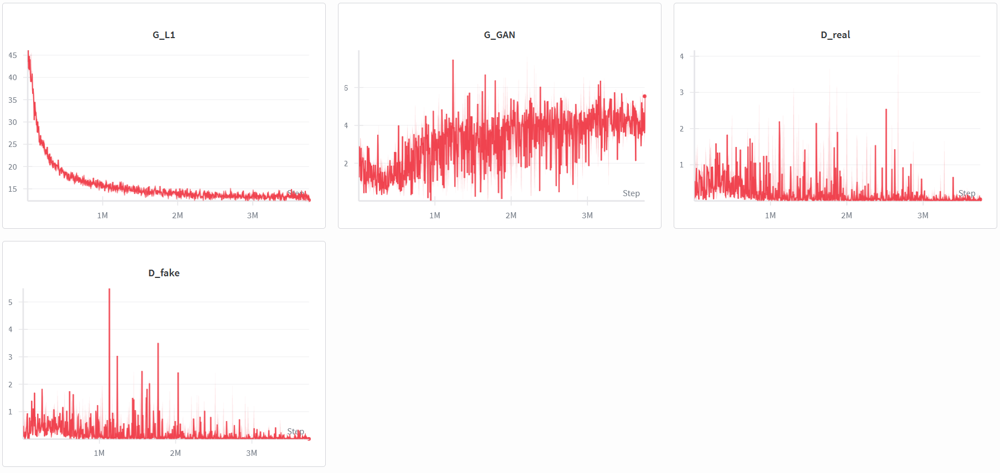
----------------------------
Flower 2:
train call:python train.py --dataroot ./datasets/flowers_dataset --name flower --model pix2pix --direction AtoB --dataset_mode aligned --netG unet_256 --netD basic --input_nc 1 --output_nc 3 --batch_size 72 --no_flip --display_winsize 256 --n_epochs 100 --n_epochs_decay 50 --lr 0.00015 --preprocess none --save_epoch_freq 10 --use_wandb

G_L1 : started at around 45. logarithmic decay to ~11
G_GAN: statrted at 1.5, fell noisily to 1, then grew slight oscillating around 1.5.
D_real: started at .4, kept oscillating around the same value
D_fake: started at .4, kept oscillating around the same value
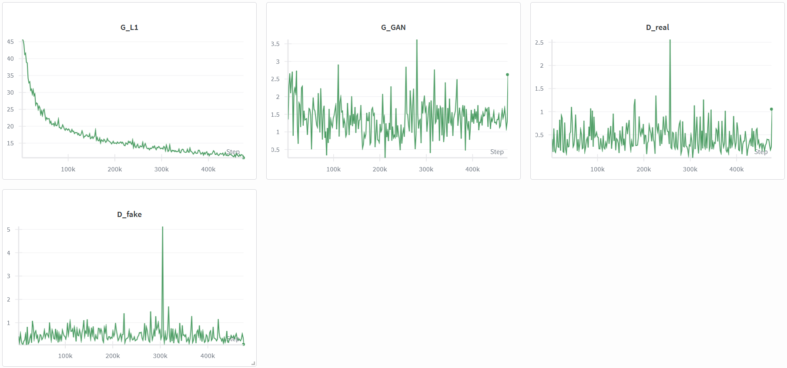
------------------------------

Flower 3:
train call: python train.py --dataroot ./datasets/flowers_dataset --name flower --model pix2pix --direction AtoB --dataset_mode aligned --netG unet_256 --netD basic --input_nc 1 --output_nc 3 --batch_size 70 --no_flip --display_winsize 256 --n_epochs 100 --n_epochs_decay 100 --lr 0.0002 --lambda_L1 50 --preprocess none --save_epoch_freq 10 --use_wandb

G_L1 : started at around 23. logarithmic decay to ~5.5
G_GAN: statrted at noisily 1.5, fell noisily to 1, then grew slight noisily to around 1.3.
D_real: started at .6, noisily fell over time to around .4
D_fake: started at .5, noisily fell over time to around .4
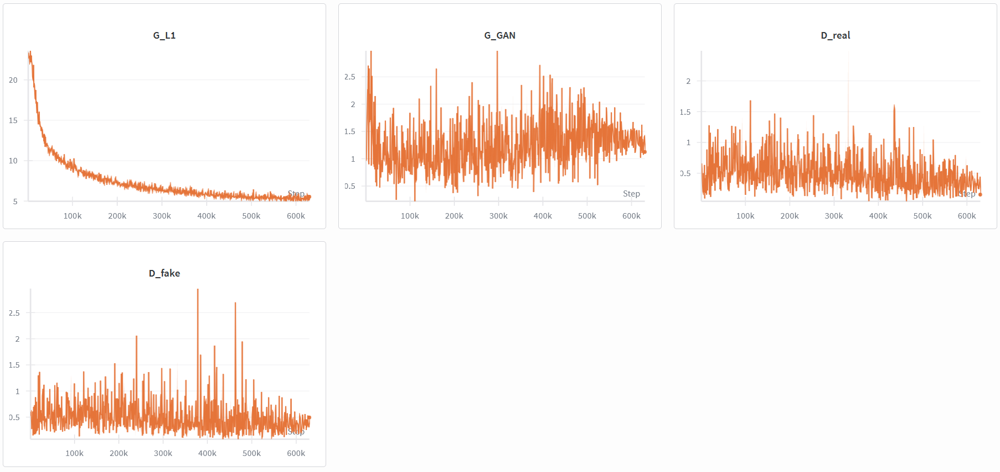

----------------------------------
Flower 4:
train call: python train.py --dataroot ./datasets/flowers_dataset --name flower --model pix2pix --direction AtoB --dataset_mode aligned --netG unet_256 --netD basic --input_nc 1 --output_nc 3 --batch_size 70 --no_flip --display_winsize 256 --n_epochs 125 --n_epochs_decay 125 --lr 0.0001 --lambda_L1 50 --preprocess none --save_epoch_freq 10 --use_wandb

G_L1 : started at around 24. logarithmic decay to ~7
G_GAN: statrted at noisily 1.5, fell quickly to 1, stayed there for a bit, then grew noisily to over 2.5.
D_real: started at .5, noisily stayed there for a bit, then noisily fell over time to around .2 as G_GAN started growing
D_fake: started at .5, noislily stayed there for a bit, then noisily fell over time to around .2 as G_GAN started growing
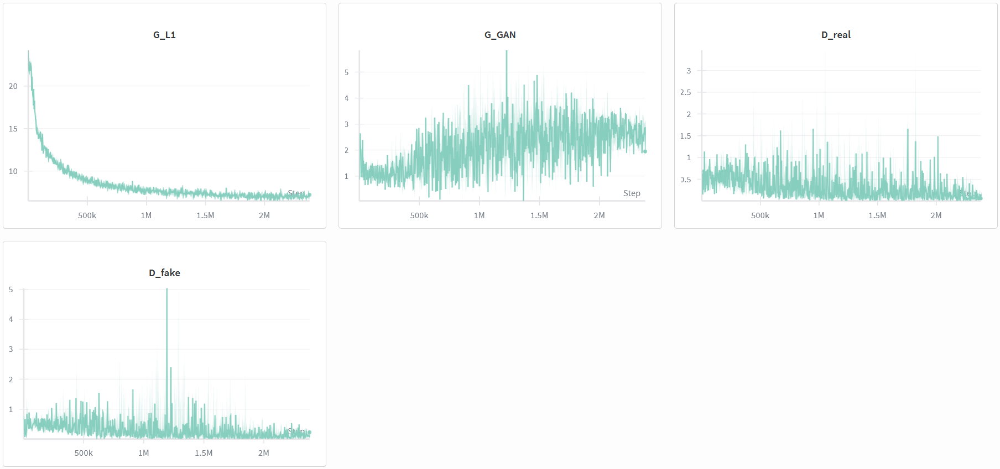

------------------------------------

Flower 5:
train call: python train.py --dataroot ./datasets/flowers_dataset --name flower --model pix2pix --direction AtoB --dataset_mode aligned --netG unet_256 --netD basic --input_nc 1 --output_nc 3 --batch_size 70 --no_flip --display_winsize 256 --n_epochs 50 --n_epochs_decay 50 --lr 0.00025 --lambda_L1 65 --preprocess none --save_epoch_freq 10 --use_wandb

G_L1 : started at around 28. logarithmic decay to ~9.5
G_GAN: statrted at noisily 2.5, fell quickly to 1.2, stayed there for a bit, then grew noisily to over 2.5.
D_real: started at .5, noisily stayed there for a bit, then noisily fell over time to around .2 as G_GAN started growing
D_fake: started at .5, noislily stayed there for a bit, then noisily fell over time to around .2 as G_GAN started growing
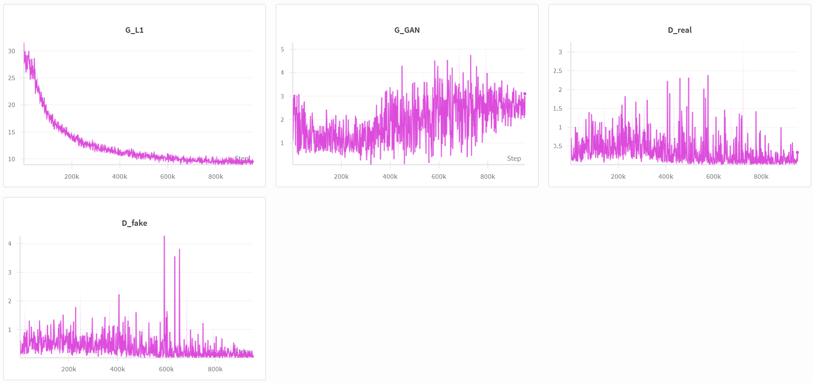

------------------------------------

Flower 6:
train call: python train.py --dataroot ./datasets/flowers_dataset --name flower --model pix2pix --direction AtoB --dataset_mode aligned --netG unet_256 --netD basic --input_nc 1 --output_nc 3 --batch_size 70 --no_flip --display_winsize 256 --n_epochs 125 --n_epochs_decay 125 --lr 0.00022 --lambda_L1 85 --preprocess none --save_epoch_freq 10 --use_wandb

G_L1 : started at around 26. logarithmic decay to ~10.5
G_GAN: statrted at noisily 2, fell quickly to 1.2, oscillated there for a bit, then grew noisily to over 3, then slow and noisily to over 3.5.
D_real: started at .5, noisily stayed there for a bit, then noisily fell over time to around .2 and .1 as G_GAN started growing
D_fake: started at .5, noislily stayed there for a bit, then noisily fell over time to around .2 and .1 as G_GAN started growing
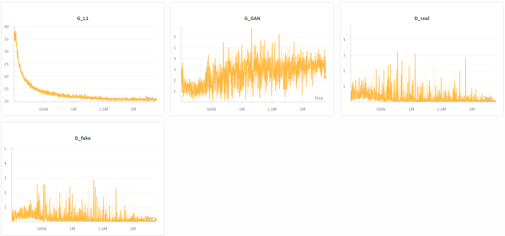

-------------------------------------------

Flower 7:
train call: python train.py --dataroot ./datasets/flowers_dataset --name flower --model pix2pix --direction AtoB --dataset_mode aligned --netG unet_256 --netD basic --input_nc 1 --output_nc 3 --batch_size 70 --no_flip --display_winsize 256 --n_epochs 50 --n_epochs_decay 0 --lr 0.0008 --lambda_L1 85 --preprocess none --save_epoch_freq 10 --use_wandb

G_L1 : started at around 38. ;inear decay upto 35, then logarithmic decay to ~13.5
G_GAN: statrted at noisily 2, fell slowly to ~1.5, oscillated there for a bit, then grew very noisily to over 2.
D_real: started at .5, very noisily stayed around there, regualr drops to .25
D_fake: started at .5, very noisily stayed around there, regualar drops to .25
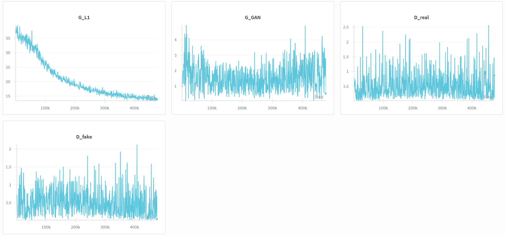

---------------------------------------------

Flower 8:
train call: python train.py --dataroot ./datasets/flowers_dataset --name flower --model pix2pix --direction AtoB --dataset_mode aligned --netG unet_256 --netD basic --input_nc 1 --output_nc 3 --batch_size 70 --no_flip --display_winsize 256 --n_epochs 75 --n_epochs_decay 0 --lr 0.0015 --lambda_L1 85 --preprocess none --save_epoch_freq 10 --use_wandb

G_L1 : started at around 37.5. linear decay upto 34, then logarithmic decay to ~13.5
G_GAN: statrted noisily at 2, fell slowly to ~1, oscillated there for a bit, then grew very noisily to over 3, then very noisily started falling again to around 2.5.
D_real: started at .5, very noisily stayed around there, then very noisily fell as G_GAN grew, extreme oscillations to 0 and 1
D_fake: started at .5, very noisily stayed around there, then very noisily fell as G_GAN grew, extreme oscillations to 0 and 1
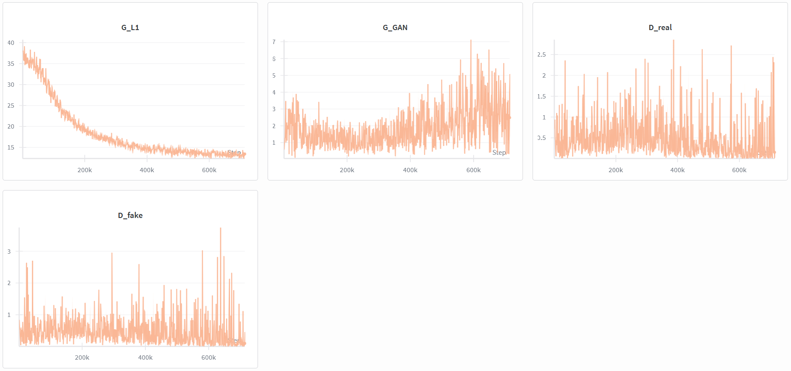

-------------------------------------------------

Flower 9:
train call : python train.py --dataroot ./datasets/flowers_dataset --name flower --model pix2pix --direction AtoB --dataset_mode aligned --netG unet_256 --netD basic --input_nc 1 --output_nc 3 --batch_size 1 --no_flip --display_winsize 256 --n_epochs 150 --n_epochs_decay 75 --lr 0.0002 --preprocess none --save_epoch_freq 10 --use_wandb

This training was stopped at 120 epochs

G_L1 : noisily started at around 40. noisy logrithmic decay upto 20, then noisily stayed there
G_GAN: statrted noisily at 3, grew noisly to around 8, oscillated there for a bit, then noisily stayed there
D_real: started noisliy at .5, soon decayed to almost mostly 0 with occassional random peaks.
D_fake: started noisliy at .2, soon decayed to almost mostly 0 with occassional random peaks.
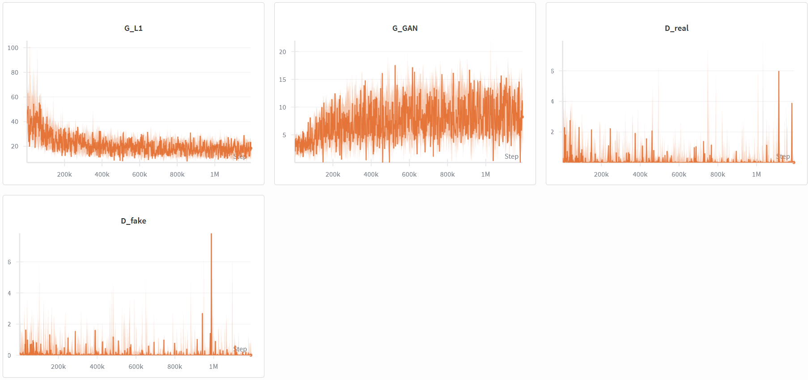

-------------------------------------------------

Flower 10:
train call: python train.py --dataroot ./datasets/flowers_dataset --name flower --model pix2pix --direction AtoB --dataset_mode aligned --netG unet_256 --netD basic --input_nc 1 --output_nc 3 --batch_size 1 --no_flip --display_winsize 256 --n_epochs 150 --n_epochs_decay 75 --lr 0.0002 --lambda_L1 80 --preprocess none --save_epoch_freq 10 --use_wandb

This training was stopped at 210 epochs

G_L1 : noisily started at around 33. noisy logrithmic decay upto 20, then slow noisy almost linear decay upto 15
G_GAN: statrted noisily at 2.5, grew noisly to around 8, oscillated there for a a while, then noisily grew upto 12 towards the end of the run
D_real: started noisliy at 1, soon decayed almost mostly to 0 with occassional random peaks.
D_fake: started noisliy at .2, soon decayed almost mostly to 0 with occassional random peaks.
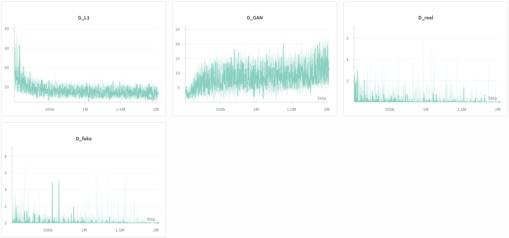

---------------------------------------------------

Flower 11:
train call: python train.py --dataroot ./datasets/flowers_dataset --name flower --model pix2pix --direction AtoB --dataset_mode aligned --netG unet_256 --netD basic --input_nc 1 --output_nc 3 --batch_size 1 --no_flip --display_winsize 256 --n_epochs 100 --n_epochs_decay 100 --lr 0.0004 --preprocess none --save_epoch_freq 10 --use_wandb --use_label_smoothing  --instance_noise_std 0.1 --noise_decay

G_L1 : noisily started at around 40. noisy logrithmic decay upto 20, then slow noisy almost linear decay upto 15
G_GAN: statrted noisily at 2.5, grew noisly to around 5, then slowly noisy fall to 2.5, oscillated there for a a while, then noisily grew upto 7.5 towards the end of the run.
D_real: started noisliy at 1, soon decayed almost mostly to 0 over time with occassional random peaks.
D_fake: started noisliy at .5, soon decayed almost mostly to 0 over time with occassional random peaks.
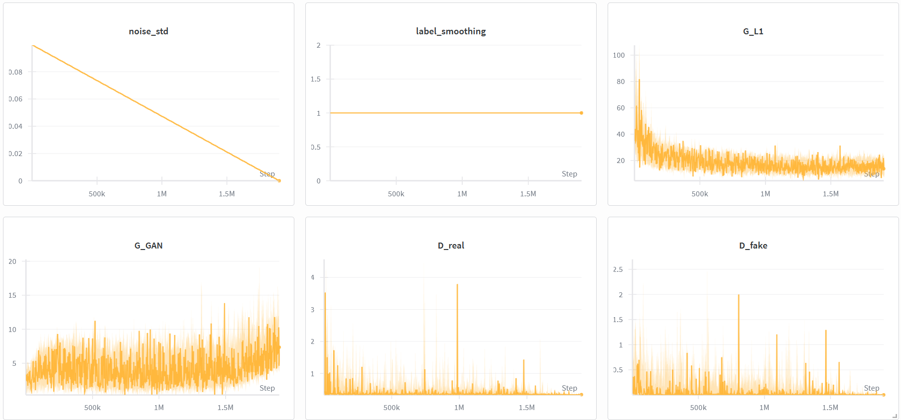

---------------------------------------------------

Flower 12:
train call : python train.py --dataroot ./datasets/flowers_dataset --name flower --model pix2pix --direction AtoB --dataset_mode aligned --netG unet_256 --netD basic --input_nc 1 --output_nc 3 --batch_size 32 --no_flip --display_winsize 256 --n_epochs 100 --n_epochs_decay 100 --lr 0.0003 --preprocess none --save_epoch_freq 20 --use_wandb --use_label_smoothing  --instance_noise_std 0.05 --noise_decay

G_L1 : started at around 43. logrithmic decay upto 11
G_GAN: statrted noisily at 3, fell relatively quick noisly to around 1.5, then grew relatively quickly noisily upto 3, then noise decayed over time as the function grew upto 3.5.
D_real: started noisliy at .5, grew noisily upto 1, then fell noisily to to almost .2, and stayed around there as the noise slowly decayed.
D_fake: started noisliy at .4, grew noisily upto .5, then fell noisily to to almost .1, and stayed around there as the noise slowly decayed.
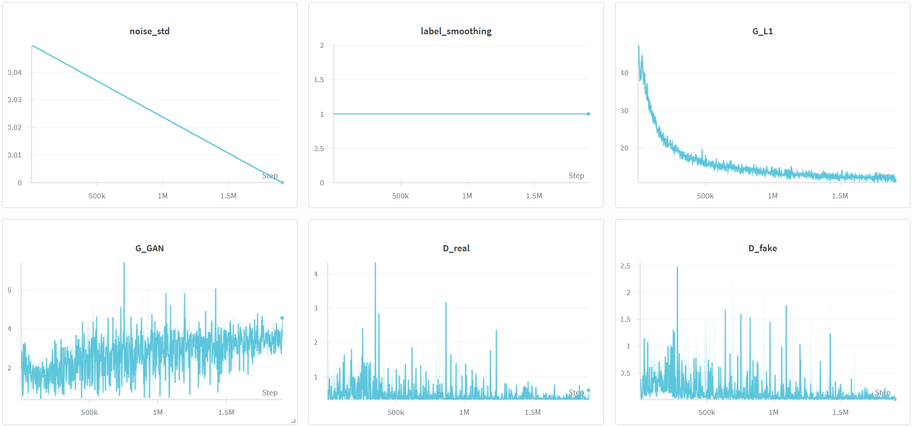

---------------------------------------------------

Flower 13:
train call: python train.py --dataroot ./datasets/flowers_dataset --name flower --model pix2pix --direction AtoB --dataset_mode aligned --netG resnet_9blocks --netD basic --input_nc 1 --output_nc 3 --batch_size 16 --no_flip --display_winsize 256 --n_epochs 100 --n_epochs_decay 100 --lr 0.0032 --preprocess none --save_epoch_freq 20 --norm instance --use_wandb

This training was stopped at 50 epochs

G_L1 : started at around 45. almost linear noisy decay upto 31
G_GAN: statrted noisily at 2.5 stayed there for a bit, grew noisily upto 7 stayed there for a bit, suddenly noisy growth upto 10, then quick dip down to 5, then grew upto 12.5
D_real: started noisliy at .5, fell to almost 0, stayed around there as the noise slowly decayed. 
D_fake: started noisliy at .5, fell to almost 0, stayed around there as the noise slowly decayed. 
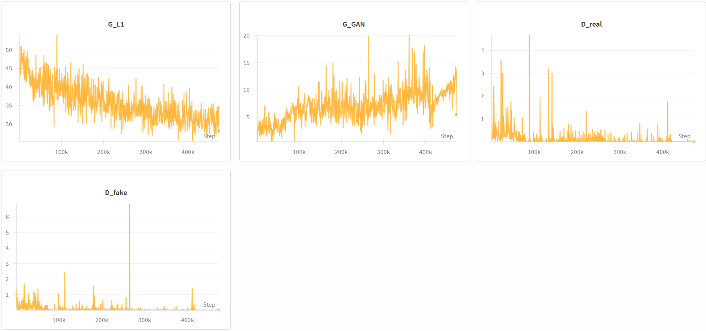

---------------------------------------------------

Flower 14:
train call: python train.py --dataroot ./datasets/flowers_dataset --name flower --model pix2pix --direction AtoB --dataset_mode aligned --netG resnet_9blocks --netD basic --norm instance --no_dropout --input_nc 1 --output_nc 3 --batch_size 8 --no_flip --display_winsize 256 --n_epochs 100 --n_epochs_decay 100 --lr 0.0002 --gan_mode lsgan --lambda_L1 75.0 --preprocess resize_and_crop --load_size 286 --crop_size 256 --save_epoch_freq 20 --use_wandb

This training was stopped at 107 epochs

G_L1 : started at around 32.5. almost linear noisy decay upto 13
G_GAN: statrted noisily at 1, perfectly stayed around there with slow decay in noise.
D_real: started noisliy at .3, decayed relatively quick to almost 0, stayed there as the noise slowly decayed. 
D_fake: started noisliy at .1, decayed relatively quick to almost 0, stayed there as the noise slowly decayed. 
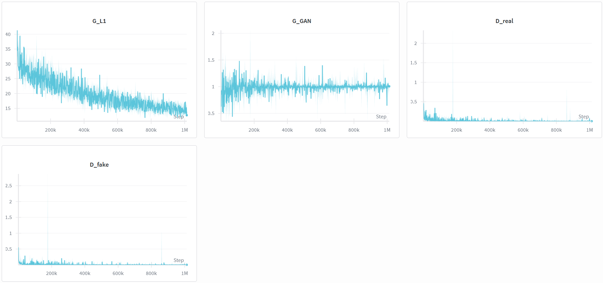

-----------------------------------------

Flower 15:
train call: python train.py --dataroot ./datasets/flowers_dataset --name flower --model pix2pix --direction AtoB --use_wandb

G_L1 : started at around 42. almost linear noisy decay upto 20
G_GAN: statrted noisily at 2.5, then noisily exploded and grew to around 15
D_real: started noisliy at .1, decayed relatively quick to almost 0, stayed there as the noise slowly decayed. 
D_fake: started noisliy at .1, decayed relatively quick to almost 0, stayed there as the noise slowly decayed. 

--------------------------------------------

