# draw2pix

> Near real-time conversion for sketches into flower drawings using pix2pix GAN  🎨 → 🌸

Transform rough sketches of flowers into photorealistic images through an interactive web interface. Built on the pix2pix architecture and trained on a custom dataset of 9.5k+ curated flower images.


---

## ✨ Features

- 🖌️ **Interactive Drawing Canvas** - Draw sketches directly in your browser
- ⚡ **Near real-time Inference** - See results instantly (GPU: ~100ms, CPU: ~1-2s)
- 🎨 **Multiple Variations** - Generate up to 4 different outputs from one sketch with diversity and noise strength settings
- 🔄 **Model Switching** - Load and switch between multiple trained models at runtime
- 📥 **Auto-Updates** - Automatically downloads pretrained models from GitHub releases
- 🔍 **Auto-Detection** - Intelligently reads model parameters from binaries

---

## 🚀 Quick Start

### Prerequisites

- Python 3.10.x

### Installation [Windows/Linux/Mac]

1. **Clone the repository**
   ```bash
   git clone https://github.com/Cosmic-Infinity/draw2pix.git
   cd draw2pix
   ```

2. **Install dependencies**
   ```bash
   pip install -r requirements.txt
   ```

3. **Run the web application**
   ```bash
   # Windows
   start.bat
   
   # Linux/Mac
   python app/web_app.py --model_dir pretrained_models
   ```

4. **Open your browser**
   ```
   http://127.0.0.1:5000
   ```

---

## 📸 Screenshots

<div align="center">

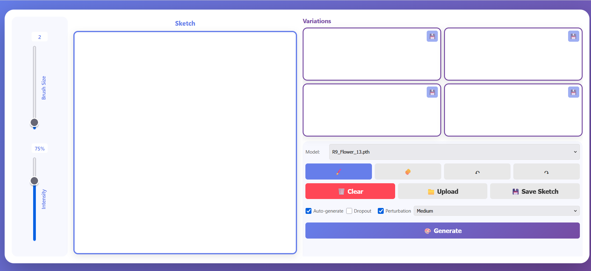
*Application interface*


*Application in use*

</div>

### Sample Outputs

<div align="center">

| Input Sketch | Generated Output |
|:------------:|:----------------:|
| 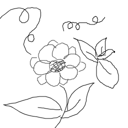 | 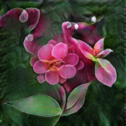 |
| 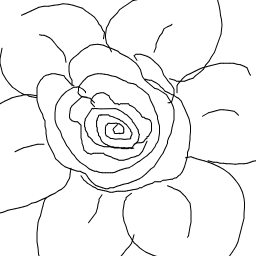 | 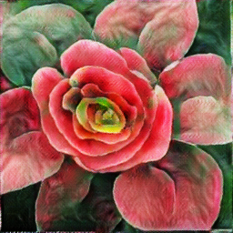 |

*Drawing and their corresponding transformation samples*

</div>

### Training result samples [Model: Flower 15]

<div align="center">

| *Input Sketch* | *Generated Output* | *Ground Truth* |
|:----------------:|:-------------------------:|:---------------------:|
| 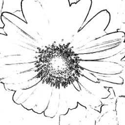 | 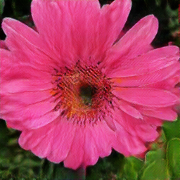 | 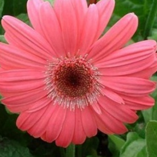 |
| 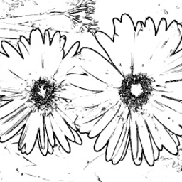 | 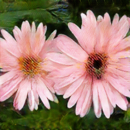 | 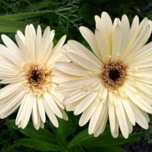 |

*Training validation samples showing model's ability to generate realistic flower images from sketches*

</div>

---

## 🎯 Usage

### Web Interface

1. **Draw** your sketch on the sketch canvas using your mouse or stylus
2. **Click "Generate"** (or leave Auto-Generate ON) to convert your sketch to a photo
3. **Adjust settings** (optional):
   - Enable/Disable Dropout
   - Perturbation strength (low/medium/high)
4. **Clear** the canvas to start over or save your results

### Command Line Options

```bash
python app/web_app.py [options]

Options:
  --model_dir       Directory containing .pth model files (default: pretrained_models)
  --input_nc        Input channels: 1 for grayscale, 3 for RGB (default: 1)
  --output_nc       Output channels: 3 for RGB (default: 3)
  --port            Port to run server on (default: 5000)
  --host            Host to run server on (default: 127.0.0.1)
```

---

## 🏗️ Project Structure

```
draw2pix/
├── app/
│   ├── index.html              # Frontend interface
│   ├── web_app.py              # Flask backend application
│   └── test_setup.py           # Setup verification script
├── pretrained_models/          # Trained model weights (.pth files)
│   ├── *.pth                   # Model binaries (15 models)
│   ├── version.txt             # Version tracking for updates
│   └── MODELS_RELEASE.md       # Model release notes
├── pix2pix/                    # Pix2pix framework (PyTorch-CycleGAN-pix2pix)
│   ├── models/                 # Model architectures (networks, base model)
│   ├── options/                # Configuration options (base, test)
│   ├── data/                   # Data loading utilities
│   ├── util/                   # Helper functions
│   ├── train.py                # Training script
│   ├── test.py                 # Inference script
│   └── THIRD_PARTY_LICENSES.txt
├── docs/                       # Comprehensive documentation
│   ├── WEB_APP_README.md       # Web app usage guide
│   ├── ARCHITECTURE.md         # System architecture details
│   ├── MODEL_REFERENCE.md      # All 15 trained models reference
│   └── RELEASE_GUIDE.md        # Release creation guide
├── Progress Tracker/           # Training logs and progress
│   ├── Shubham.md              # Model training tracker
│   ├── Sourajit.md             # Frontend development tracker
│   └── train_graphs/           # Training visualization graphs
├── flowers Dataset/            # Custom curated dataset (9.5k images)
├── screenshots/                # Application screenshots & samples
├── UI Design/                  # UI mockups and designs
├── requirements.txt            # Python dependencies
├── start.bat                   # Quick start script (Windows)
└── LICENSE                     # MIT License
```

---

## 🔬 Model Details

### Architecture
- **Base**: pix2pix (Conditional GAN)
- **Generator**: U-Net-256 or ResNet-9blocks
- **Discriminator**: PatchGAN (Basic)
- **Input**: 256×256 grayscale sketches (1 or 3 channel)
- **Output**: 256×256 RGB images (3 channels)
- **Training Dataset**: 9.5k curated flower image pairs

### Available Pretrained Models (15 Total)

All models are automatically downloaded via `start.bat` or available from [GitHub Releases](https://github.com/Cosmic-Infinity/draw2pix/releases).

| Model            | Architecture | Epochs | Time    | LR      | λ_L1 | Batch | Notes                       |
| ---------------- | ------------ | ------ | ------- | ------- | ---- | ----- | --------------------------- |
| U256_Flower_1    | UNet-256     | 300    | 14h 4m  | 0.0002  | 100  | 85    | Discriminator flatline      |
| U256_Flower_2    | UNet-256     | 150    | 2h 31m  | 0.00015 | 100  | 72    | Good discriminator stability |
| U256_Flower_3    | UNet-256     | 200    | 3h 13m  | 0.0002  | 50   | 70    | Low λ_L1                    |
| U256_Flower_4    | UNet-256     | 250    | 9h 18m  | 0.0001  | 50   | 70    | Low learning rate           |
| U256_Flower_5    | UNet-256     | 100    | 3h 44m  | 0.00025 | 65   | 70    | Quick training              |
| U256_Flower_6    | UNet-256     | 250    | 9h 19m  | 0.00022 | 85   | 70    | Severe collapse             |
| U256_Flower_7    | UNet-256     | 50     | 1h 53m  | 0.0008  | 85   | 70    | High LR experiment          |
| U256_Flower_8    | UNet-256     | 75     | 2h 48m  | 0.0015  | 85   | 70    | Extreme LR                  |
| U256_Flower_9    | UNet-256     | 120*   | 13h 8m  | 0.0002  | 100  | 1     | Batch size = 1              |
| U256_Flower_10   | UNet-256     | 210*   | 22h 18m | 0.0002  | 80   | 1     | Batch size = 1              |
| U256_Flower_11   | UNet-256     | 200    | 20h 56m | 0.0004  | 100  | 1     | Label smoothing + noise     |
| U256_Flower_12   | UNet-256     | 200    | 7h 39m  | 0.0003  | 100  | 32    | Regularization techniques   |
| R9_Flower_13     | ResNet-9     | 50*    | 7h 15m  | 0.0032  | 100  | 16    | High LR instability         |
| R9_Flower_14     | ResNet-9     | 107*   | 15h 39m | 0.0002  | 75   | 8     | LSGAN + no dropout          |
| U256_Flower_15   | UNet-256     | 200    | 21h 16m | 0.0002  | 100  | 1     | RGB input (experimental)    |

**\* = Training stopped early**

📘 **For detailed training commands and loss curves, see [docs/MODEL_REFERENCE.md](docs/MODEL_REFERENCE.md)**

---

## 🛠️ Technical Stack

### Backend
- **Flask** - Web framework
- **PyTorch** - Deep learning framework
- **torchvision** - Image transformations
- **Pillow** - Image processing
- **NumPy** - Numerical operations

### Frontend
- **HTML5 Canvas** - Drawing interface
- **Vanilla JavaScript** - No framework dependencies
- **CSS3** - Modern styling with gradients and animations

### Model
- **Input**: 256×256 grayscale sketch
- **Output**: 256×256 RGB photorealistic image
- **Inference Time**: ~100ms (GPU) / ~1-2s (CPU)

---

## 📖 Documentation

- **[docs/WEB_APP_README.md](docs/WEB_APP_README.md)** - Detailed web application usage guide
- **[docs/ARCHITECTURE.md](docs/ARCHITECTURE.md)** - System architecture and data flow
- **[docs/MODEL_REFERENCE.md](docs/MODEL_REFERENCE.md)** - Complete reference for all 15 trained models
- **[docs/RELEASE_GUIDE.md](docs/RELEASE_GUIDE.md)** - Guide for creating and publishing releases
- **[Progress Tracker/](Progress%20Tracker/)** - Training logs and development progress

---

## 🎓 Training Details

The models were trained on a custom dataset of flower images with the following characteristics:

- **Dataset Size**: 9.5k manually curated image pairs (cleaned from original 12.5k)
- **Resolution**: 256×256 pixels
- **Format**: Aligned paired images (sketch | photo)
- **Hardware**: NVIDIA A2000 12GB GPU. courtesy [IoT Lab, KIIT](https://github.com/iot-lab-kiit)
- **Framework**: PyTorch with pix2pix implementation
- **Training Time**: 50-300 epochs (1h 53m to 22h 18m per model)
- **Total Experiments**: 15 model variants with different hyperparameters

### Training Challenges

Training GANs proved inherently complex due to adversarial dynamics. Key observations:

- **Discriminator Collapse**: Persistent flatlining of discriminator losses across most models
- **GAN Instability**: Multi-objective optimization creates non-convex landscape
- **Data Quality**: Edge thickness inconsistencies and natural lighting variations
- **Color Bias**: Dataset overrepresentation of yellow/white flowers


📊 **For complete training details and analysis, see [docs/MODEL_REFERENCE.md](docs/MODEL_REFERENCE.md) and [Progress Tracker/Shubham.md](Progress%20Tracker/Shubham.md)**

---

## 🤝 Contributing

This is an academic project. For questions or suggestions:

1. Open an issue on GitHub
2. Check existing documentation
3. Review the Progress Tracker for known limitations

---

## 📝 License

- **Custom Code** (app/, docs/, etc.): [MIT License](LICENSE)
- **pix2pix Framework**: BSD License - See [pix2pix/THIRD_PARTY_LICENSES.txt](pix2pix/THIRD_PARTY_LICENSES.txt)
- **Trained Models**: Created by this project (MIT License)

---


## ⚠️ Known Limitations

- Output quality varies based on sketch complexity.
- Some models may show bias towards yellow/white flowers. Probable overfitting.
- Texture details may appear stylized rather than photorealistic
- Some models may provide best results with clear, simple flower sketches
- Dropout may drastically improve output in some instances, while ruining colours/texture in others.

---

## 🔮 Future Improvements?

- [ ] Expand dataset with more diverse flower colors and species
- [ ] Experiment with higher resolution models (512×512) and upscaling techniques
- [ ] Test alternative loss functions (Wasserstein GAN, Hinge loss)
- [ ] Add progressive rendering? for better UX on slower hardware
- [ ] Implement model quantization for faster CPU inference
- [ ] Mobile-responsive UI for tablet/phone drawing

---

## 👥 Team

<div align="center">

A project made in collaboration

<table>
<tr>
<td align="center" width="35%">
<a href="https://github.com/Cosmic-Infinity">

</a>
<br />
<a href="https://github.com/Cosmic-Infinity"><b>Shubham</b></a>
<br />
<sub>🎓 Model Training<br/>🏗️ System Architecture<br/>📊 Dataset Curation<br/>📝 Report & Presentation</sub>
</td>
<td align="center" width="33%">
<a href="https://github.com/Sourasamanta">

</a>
<br />
<a href="https://github.com/Sourasamanta"><b>Sourajit</b></a>
<br />
<sub>🎨 Frontend and Design<br/>📊 Dataset Curation<br/>📝 Report & Presentation</sub>
</td>
<td align="center" width="33%">
<a href="https://github.com/Tanmandal">

</a>
<br />
<a href="https://github.com/Tanmandal"><b>Tanmay</b></a>
<br />
<sub>🕷️ Web Scraping<br/>🔧 Data Preprocessing<br/>📊 Dataset Curation<br/>📝 Report & Presentation</sub>
</td>
</tr>
<tr>
<td align="center" width="33%">
<a href="https://github.com/Shiv14Shivam">

</a>
<br />
<a href="https://github.com/Shiv14Shivam"><b>Shivam</b></a>
<br />
<sub>📊 Dataset Curation<br/>📝 Report & Presentation</sub>
</td>
<td align="center" width="33%">
<a href="https://github.com/alokkbhardwaj">

</a>
<br />
<a href="https://github.com/alokkbhardwaj"><b>Alok</b></a>
<br />
<sub>📊 Dataset Curation<br/>📝 Report & Presentation</sub>
</td>
<td align="center" width="33%">
<a href="https://github.com/Snigdha7595">

</a>
<br />
<a href="https://github.com/Snigdha7595"><b>Snigdha</b></a>
<br />
<sub>📊 Dataset Curation<br/>📝 Report & Presentation</sub>
</td>
</tr>
<tr>
<td align="center" width="33%">
<a href="https://github.com/upasana2202">

</a>
<br />
<a href="https://github.com/upasana2202"><b>Upasana</b></a>
<br />
<sub>📊 Dataset Curation<br/>📝 Report & Presentation</sub>
</td>
<td align="center" width="33%">
<a href="https://github.com/urshita">

</a>
<br />
<a href="https://github.com/urshita"><b>Urshita</b></a>
<br />
<sub>📊 Dataset Curation<br/>📝 Report & Presentation</sub>
</td>
<td align="center" width="33%">
<a href="https://github.com/ankit9">

</a>
<br />
<a href="https://github.com/ankit9"><b>Ankit</b></a>
<br />
<sub><br/><br/></sub>
</td>
</tr>
<tr>
<td align="center" width="33%">
<a href="https://github.com/abhijeet841">

</a>
<br />
<a href="https://github.com/abhijeet841"><b>Abhijeet</b></a>
<br />
<sub><br/><br/></sub>
</td>
<td align="center" width="33%">
</td>
<td align="center" width="33%">
</td>
</tr>
</table>

</div>

---
